# 🎓 Gestion d’un Centre de Formation - Odoo 17

## 📘 Description du Projet
Ce projet a été réalisé dans le cadre du module **Développement sur Odoo 17**.  
L’objectif est de concevoir un **système d’information (SI)** complet pour la **gestion d’un centre de formation** à travers le développement d’un **module personnalisé** et l’intégration de modules standards d’Odoo.

---

## 🚀 Objectifs du Projet
- Développer un **module personnalisé** pour répondre aux besoins d’un centre de formation.  
- Intégrer les **modules standards** d’Odoo : `Ventes`, `Achats`, `Inventaire`.  
- Mettre en œuvre un **workflow** (validation des inscriptions, génération des attestations, etc.).  
- Créer des **vues interactives** (formulaire, liste, kanban) et un **tableau de bord**.  
- Gérer les **droits d’accès** selon les rôles (administrateur, formateur, participant).

---

## 🗂️ Structure du Module
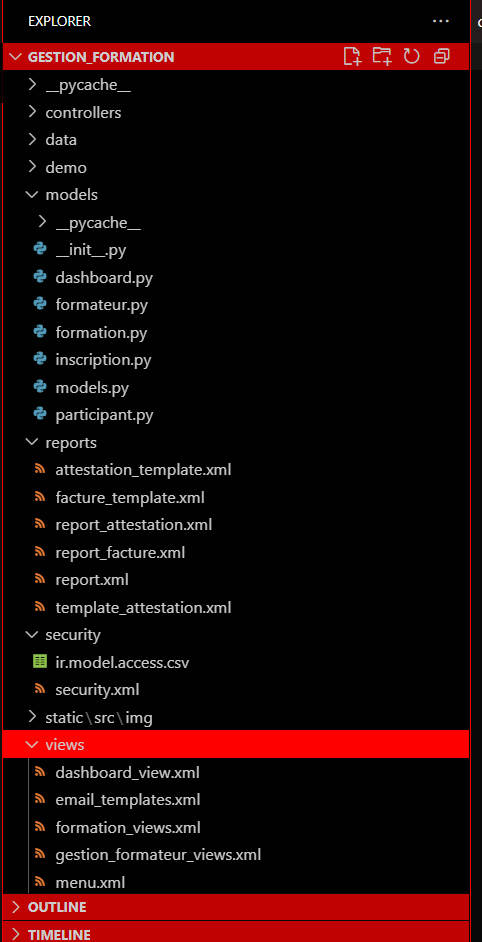

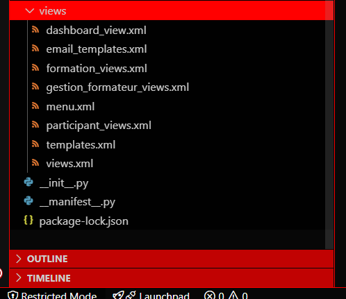

---

## 🧩 Modules Développés
### 1. `formateur`
- Gestion des informations des formateurs (nom, spécialité, ...).  
- Liaison avec les formations qu’ils dispensent.

### 2. `formation`
- Création et gestion des formations : titre, durée, prix, formateur, description.  
- Suivi des places disponibles.

### 3. `participant`
- Enregistrement des participants (nom, email,...).  
- Consultation de l’historique des formations.

### 4. `inscription`
- Gestion du processus d’inscription : en attente → validée → terminée.  
- Génération automatique d’attestations de participation.

### 5. `dashboard`
- Tableau de bord récapitulatif : nombre de formations, formateurs, participants.

---

## 🧠 Fonctionnalités Clés
- **Workflow complet** : de la création de formation à la validation d’inscription.  
- **Rapport PDF** : génération d’attestation ou rapport des formations.  
- **Tableau de bord interactif** : statistiques du centre de formation.  
- **Sécurité & rôles** : droits d’accès configurés selon le profil utilisateur.

---

## ⚙️ Technologies Utilisées
- **Odoo 17**
- **Python** → logique métier (`models`, `controllers`)  
- **XML** → vues, menus, actions  
- **JavaScript (optionnel)** → éléments interactifs du tableau de bord  
- **PostgreSQL** → base de données

---

## 🖼️ Captures d’Écran du Module

### 🔐 Fichier de Sécurité
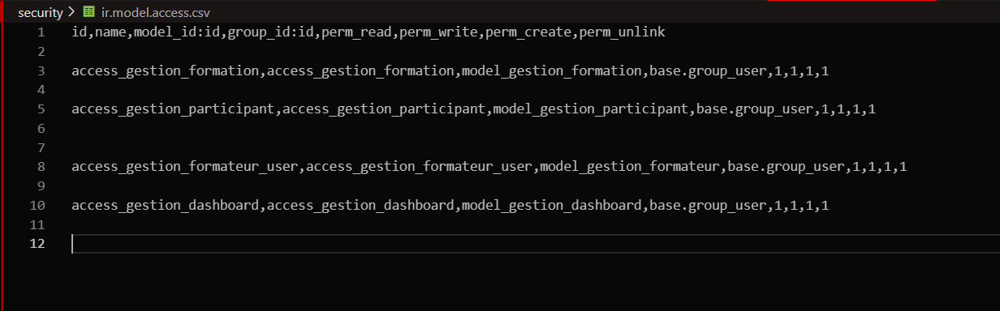

### 📊 Tableau de Bord
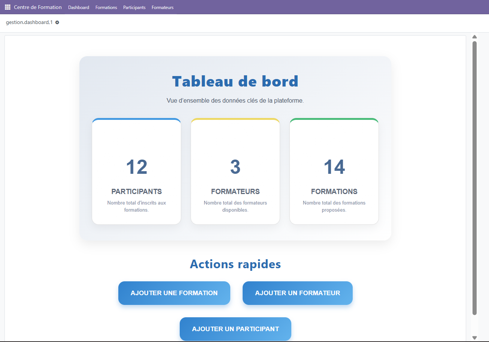

### 🎓 Formations
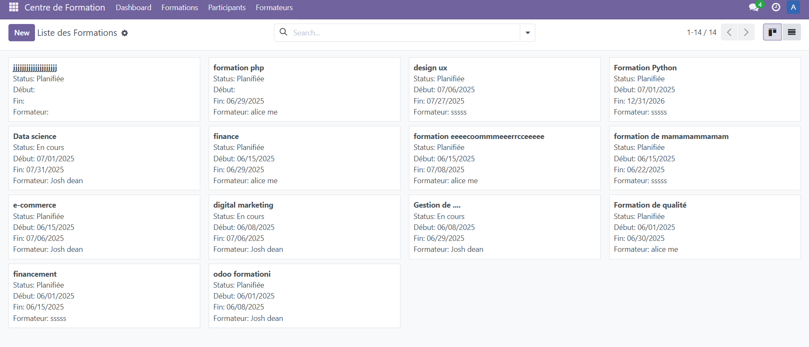
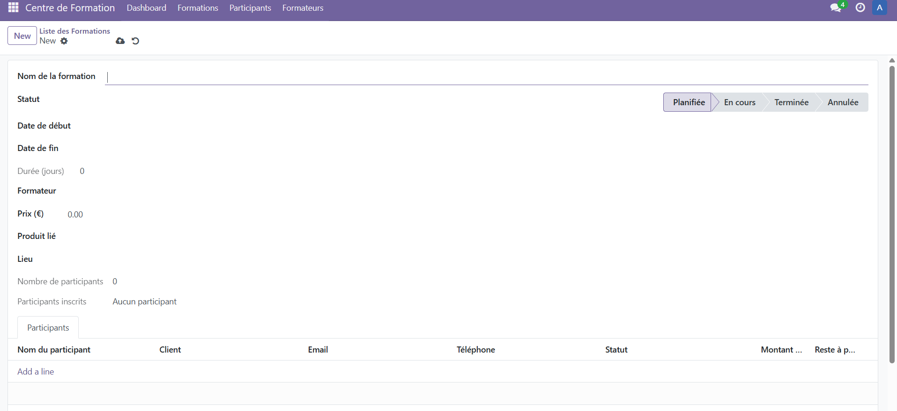

### 👩‍🎓 Participants
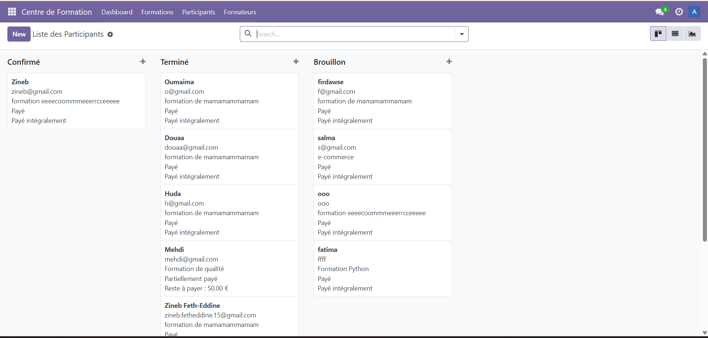

### 👨‍🏫 Formateurs
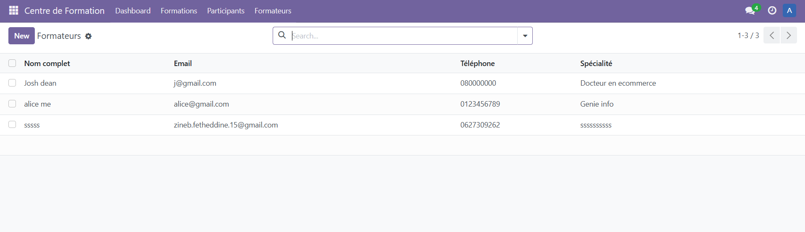
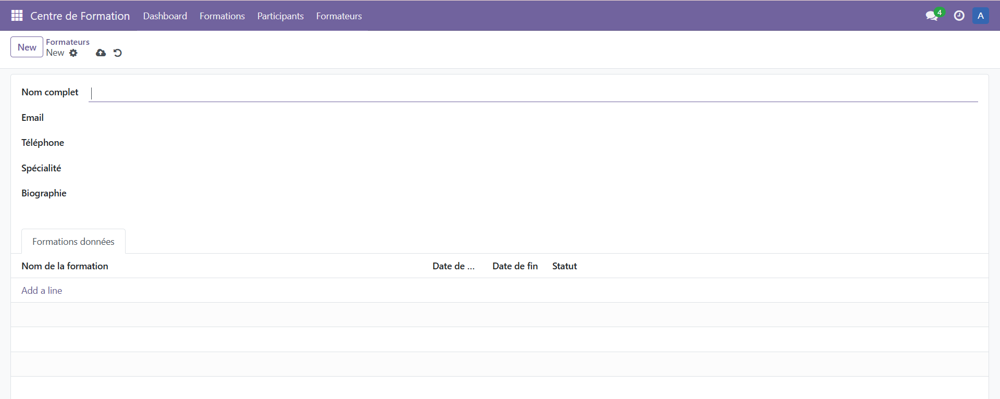

### 💼 Ventes
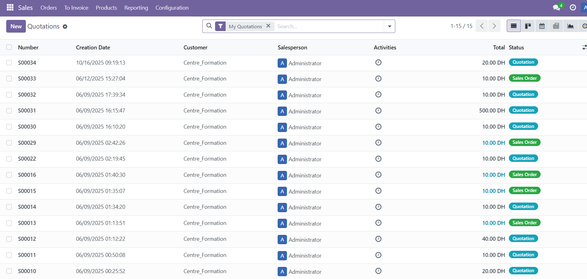

### 🧾 Facturation

### 🪪 Attestation de Participation

### 📦 Commande de Vente
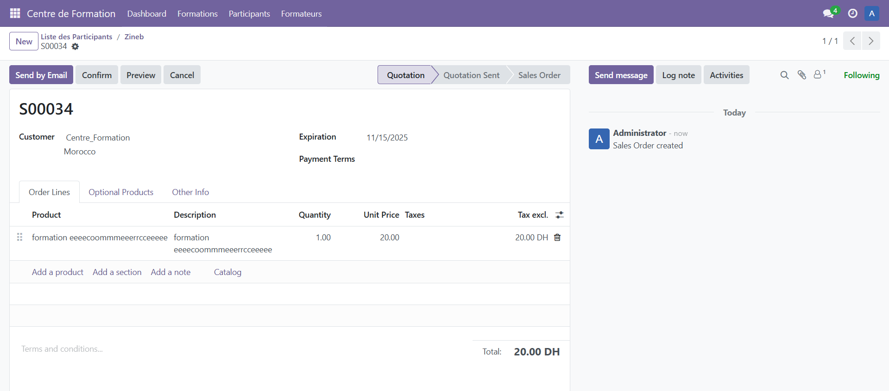

### 💰 Facture
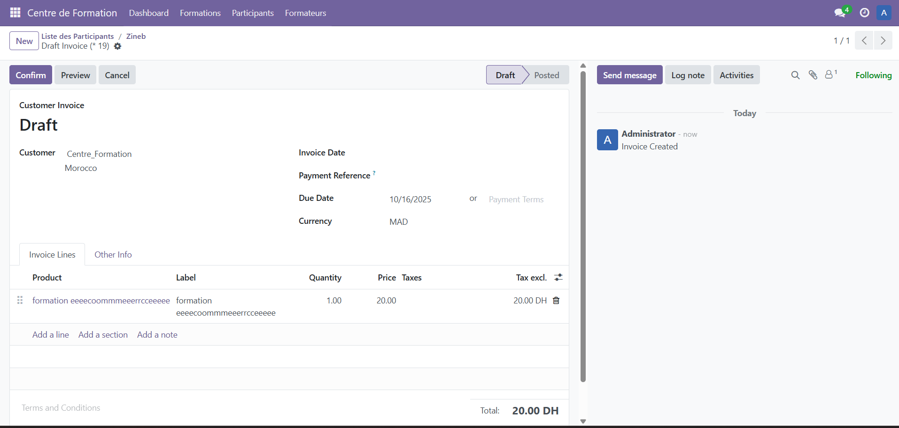

---

## 🏁 Conclusion
Le module **Gestion d’un Centre de Formation** sur **Odoo 17** offre une solution complète pour automatiser la gestion des formateurs, formations, participants et inscriptions.  
Grâce à l’intégration des modules standards d’Odoo et au développement d’un tableau de bord dynamique, le système facilite la **supervision**, la **planification** et la **prise de décision** au sein du centre.  
Ce projet illustre la maîtrise du **cycle complet de développement sur Odoo**, de la modélisation des données à la mise en œuvre fonctionnelle.

---

👩‍💻 **Réalisé par :** Zineb Feth-Eddine  
📘 *Projet académique — Développement sur Odoo 17*
